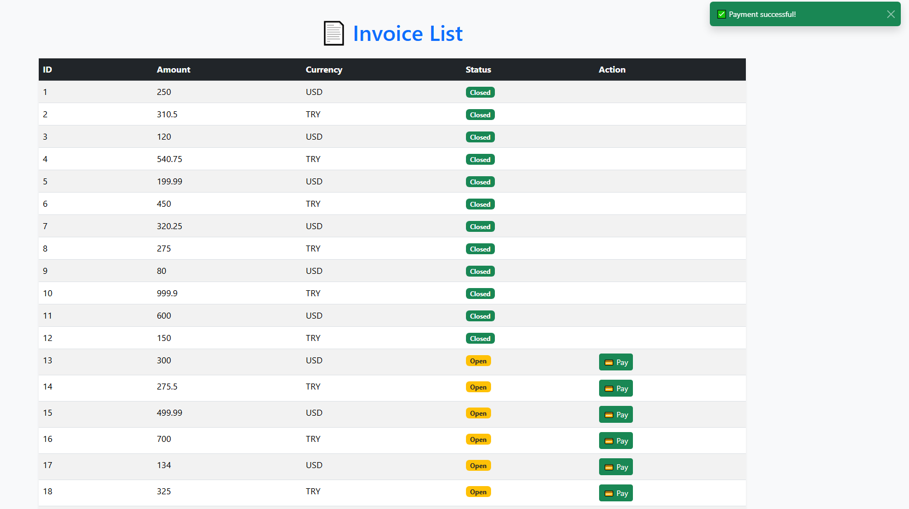

# Payment Collection Project

This is a microservices-based payment collection system developed during my internship at Turkcell. The project consists of two separate Spring Boot applications:

## 🔹 paymentservice/

- Starts with a main dashboard (`index.html`) that links to both invoices and stats pages.
- Allows users to create invoices manually or simulate them.
- Sends payment data (in TRY or USD) to Kafka.
- Frontend built with Thymeleaf (`index.html`, `invoices.html`)

## 🔹 tahsilatservice/

- Kafka consumer that receives the payment data.
- Stores payments in an H2 database (separated by currency).
- Provides statistics for payments (`stats.html`) and makes it accessible through the main index page.

## 💻 Technologies Used

- Java 17
- Spring Boot 3
- Apache Kafka
- H2 Database
- Thymeleaf
- Maven

## 🚀 How to Run the Project

1. Start Zookeeper and Kafka.
2. Run both microservices:
   - `paymentservice`: `localhost:8080/index`
   - `tahsilatservice`: Automatically works as consumer and serves stats at `localhost:8081/stats`
3. From `index.html`, you can navigate to:
   - **Invoices Page:** for invoice creation
   - **Stats Page:** to view real-time payment statistics

## 📸 Demo Screenshots

**Main Menu (`index.html`)**  

**Invoices Page (`invoices.html`)**  

**Stats Page (`stats.html`)**  

## 👨‍💻 Author

Developed by Meriç Uysalerler as part of the Turkcell internship program.
